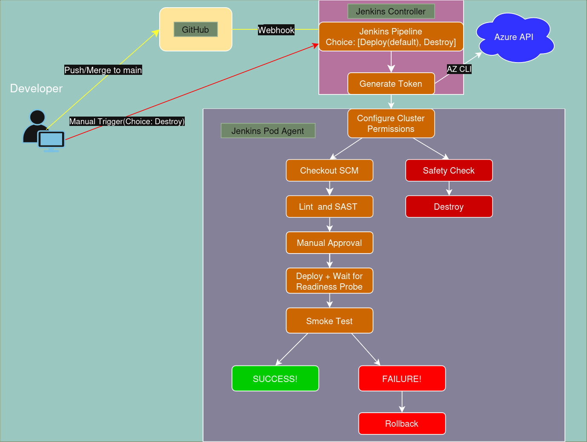

# Continuous Delivery Pipeline

A pipeline encompassing the second half of a CI/CD lifecycle which delivers an application using a push based GitOps approach.

**Goal:** Implement a solid Continuous Delivery pipeline with a pre-provided web application image pulled from ACR.

**Pipeline and Helm Chart Features:**
- Helm Chart for centralized deployment and enabling modularity between environments for future implementation
- KEDA for versatile pod autoscaling including:
    * A baseline of 2 pods to ensure availability at all times
    * Cron scheduling to 5 pods as a baseline for high traffic hours (08:00 AM - 12:00 AM)
    * Additional CPU scaling triggering at 70% to catch traffic spikes early and Memory scaling at 80% to avoid scaling up unnecessarily.
- PVC allowing application persistent storage
- Jenkins Kubernetes cloud agent for fresh build environments and resource efficiency.
- Continuous Delivery deploying only upon human intervention
- Linting, Validation and Security scanning of helm chart using external tools (kubeconform, kube-linter)
- Pipeline waits for Health check to respond before announcing success, fails after 3 minutes of waiting.

**Environment:** To implement this project I worked on the Azure infrastructure provided. 
- A single VM to be used as a jenkins controller bootstrapped with the necessary tools and permissions to access a cluster.
- An AKS cluster with a bootstrapped dedicated namespace, pre-configured ingress controller.

**Challenges:** 
- Due to the limited permissions (single namespace, no access to Role and RoleBinding creation) I had to implement the cloud agent in an alternative method.
For this, I used the permissions of the VM to generate a token in real time as a step in the pipeline and injected it as a pipeline environment variable to be used by the agent to authorize resource deployment.
- Due to the provided container image having significant security flaws such as running as root and using port 80 internally (likely due to its age, the image uses Python 2.7.14) implementing security best practices and least privilege required changing the running user and container port (to be above 1024 privileged ports). Originally, I used the init container to change permissions as well, but later moved to the following solution:
    * Since the container requires writing data and should ideally be stateful (since it counts visits to the website) I used the init container to initialize the files required by the app (index.html and pickle_data.txt) in PV.

**Steps taken to complete the task:**
- I first researched the tools I would need, including KEDA az cli and kubelogin, the environment I would be working in (Azure) and its concepts.
- I then explored the environment provided to me to verify necessary access and understand its mechanics, including Azure managed identity, and on the fly token generation.
- After this, I created a plan which included the Jenkins and Kubernetes mechanisms I would need to utilize and the features I would like to implement.
- I then began implementing starting with the helm chart with resources such as deployment, ClusterIP service, ImagePullSecret, KEDA and ingress rules. I focused on making the helm charts modular to enable reusability using templating and helpers, proper labeling for versatile search and filter, and ensuring security best practices by injecting sensitive values in real time using an external secret (Jenkins) and ensuring all containers run as dedicated users rather than root.
- After further exploring the app I decided to implement a PVC to allow the app to store its data using Azure File CSI (which I found was preconfigured in the cluster) although this is the right architecture for the app, it posed some interesting behavior due to the Probes I had implemented and the app's nature, since multiple containers were trying to write at once, they would  occasionally overwrite each other's changes. To avoid this behavior file locking must be implemented inside the application itself which I unfortunately have no access to since the image is pre-built and provided.

**Conclusion:**
I found the project interesting and enjoyable. The permission limitations in the provided environment and application design pushed me to be creative in my problem solving.
Given more time and permissions I would have liked to implement an alerting mechanism to notify developers and engineers of failed builds, monitoring and observability tools, an external secrets tool such as vault or Azure Key Vault.
With access to the source code of the app. I would also have liked to implement file locking and potentially a message broker to handle shared application storage more reliably.

